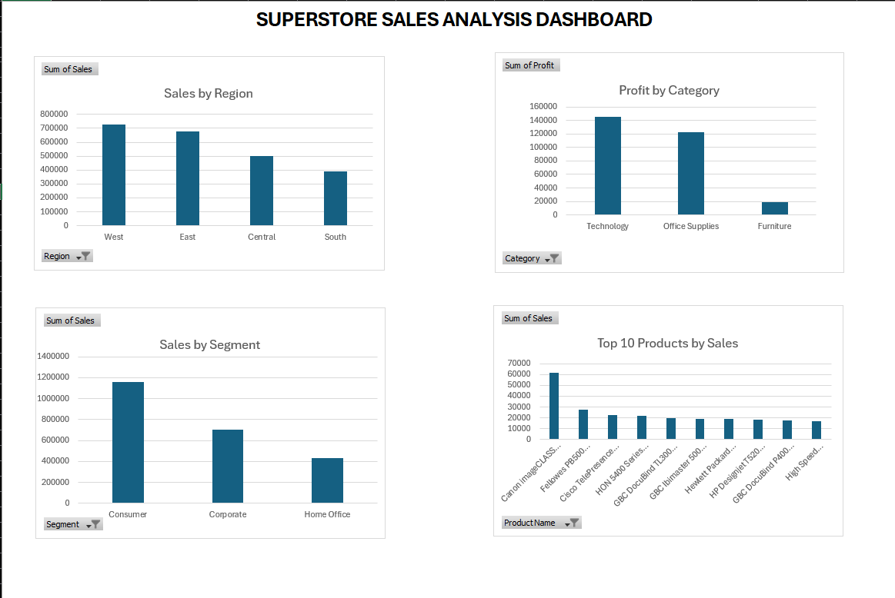
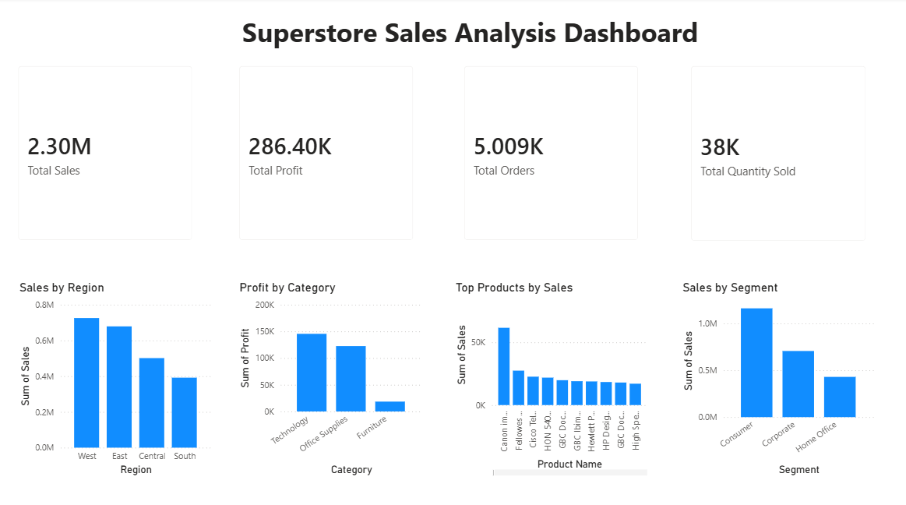
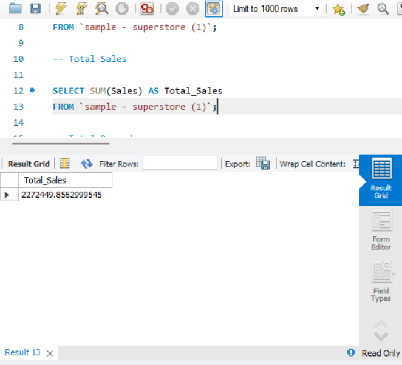
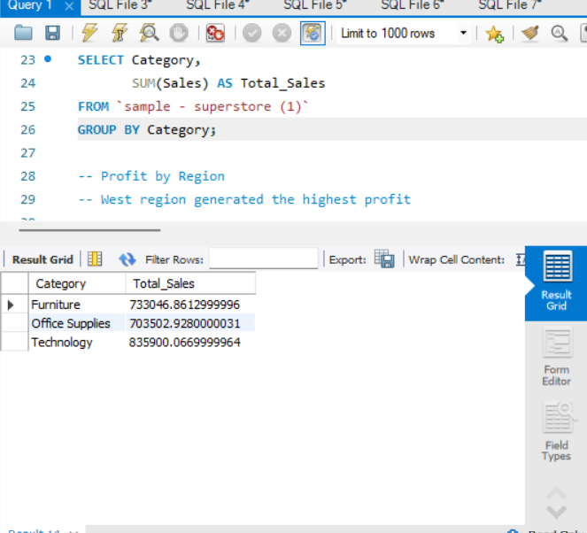
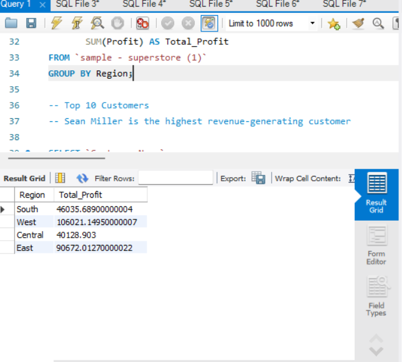
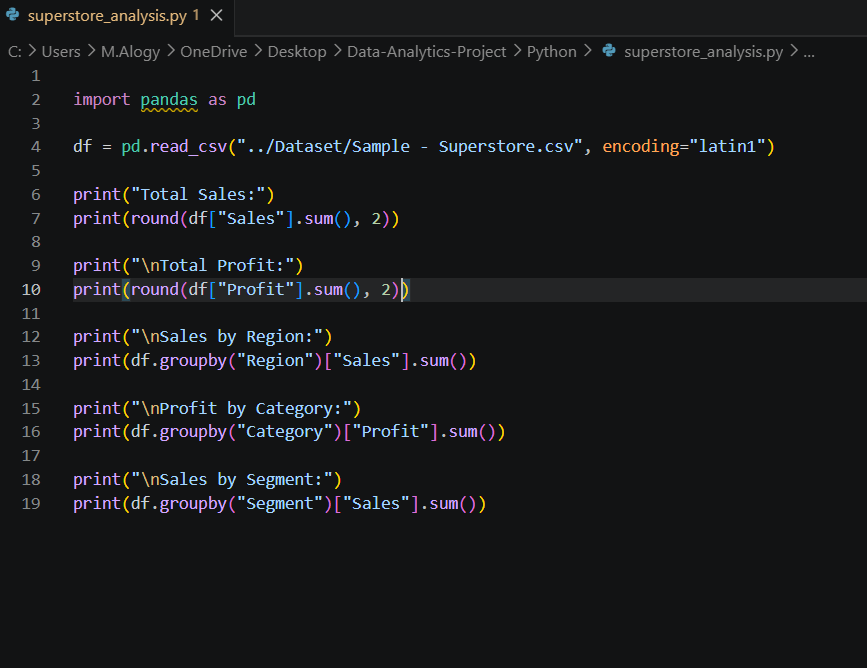
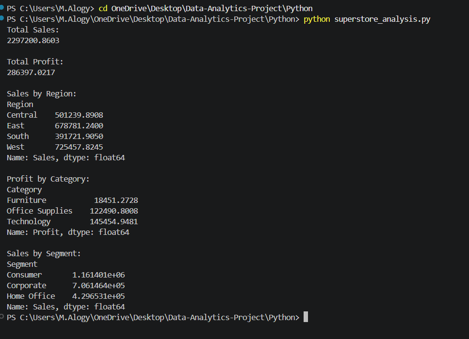

# Data Analytics Project - Superstore Sales Analysis

## Project Overview

This project analyzes Superstore sales data using Excel, SQL, Python, and Power BI. The objective is to identify sales trends, profit performance, customer behavior, and regional performance to support business decision-making.

---

## Dataset

Dataset: Sample Superstore Dataset

Records: 9,994

Columns: 21

---

## Tools Used

- Microsoft Excel
- MySQL
- Python (Pandas)
- Power BI
- GitHub

---

## Excel Analysis

Performed data cleaning and exploratory analysis using Excel.

Key tasks:
- Data inspection
- Sorting and filtering
- Basic business analysis
- Data validation

---

## SQL Analysis

### Total Sales

```sql
SELECT SUM(Sales) AS Total_Sales
FROM `sample - superstore (1)`;
```

### Total Records

```sql
SELECT COUNT(*)
FROM `sample - superstore (1)`;
```

### Sales by Category

```sql
SELECT Category,
       SUM(Sales) AS Total_Sales
FROM `sample - superstore (1)`
GROUP BY Category;
```

### Profit by Region

```sql
SELECT Region,
       SUM(Profit) AS Total_Profit
FROM `sample - superstore (1)`
GROUP BY Region;
```

### Top 10 Customers

```sql
SELECT `Customer Name`,
       SUM(Sales) AS Total_Sales
FROM `sample - superstore (1)`
GROUP BY `Customer Name`
ORDER BY Total_Sales DESC
LIMIT 10;
```

### Top 10 Products by Sales

```sql
SELECT `Product Name`,
       SUM(Sales) AS Total_Sales
FROM `sample - superstore (1)`
GROUP BY `Product Name`
ORDER BY Total_Sales DESC
LIMIT 10;
```

---

## Python Analysis

Used Pandas to perform:

- Total Sales Calculation
- Total Profit Calculation
- Sales by Region
- Profit by Category
- Sales by Segment

Example:

```python
import pandas as pd

df = pd.read_csv("../Dataset/Sample - Superstore.csv", encoding="latin1")

print(round(df["Sales"].sum(), 2))
print(round(df["Profit"].sum(), 2))
```

---

## Power BI Dashboard

Created an interactive dashboard containing:

- Total Sales KPI
- Total Profit KPI
- Total Orders KPI
- Total Quantity Sold KPI
- Sales by Region
- Profit by Category
- Top Products by Sales
- Sales by Segment

---

## Key Insights

- Total Sales: $2.29M
- Total Profit: $286K
- Technology generated the highest sales.
- West region generated the highest profit.
- Consumer segment generated the highest sales.
- Sean Miller was the highest revenue-generating customer.

---

## Screenshots

### EXCEL



### POWER BI DASHBOARD



#### SQL Analysis







#### Python Code



#### Python Output


---

## Skills Demonstrated

- Data Cleaning
- Data Analysis
- SQL Querying
- Data Visualization
- Dashboard Development
- Business Intelligence
- Python (Pandas)
- Excel
- Power BI
- Git & GitHub

  
## Project Structure

```
Data-Analytics-Project/
│
├── Dataset/
├── Excel/
├── SQL/
├── Python/
├── PowerBI/
├── Screenshots/
└── README.md
```

---

## Author

Midde Alogy
